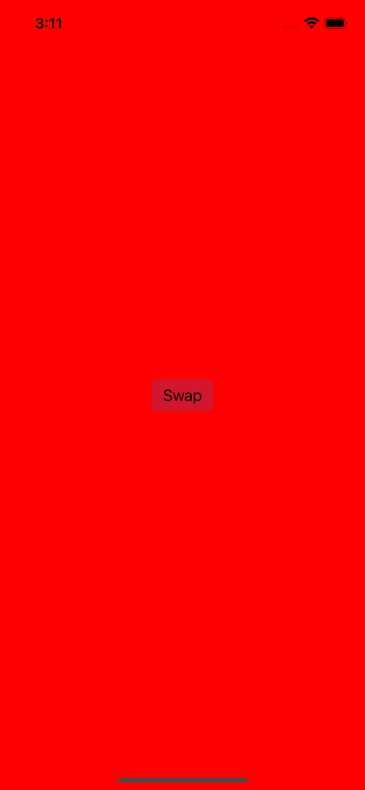
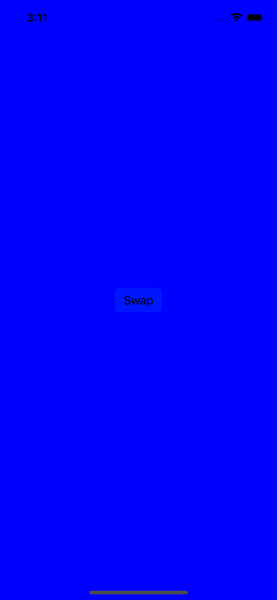

# Astronomy Screen Torch
Simple app with one button that changes screen background on click

## Screenshots

  
  &nbsp; &nbsp; &nbsp; &nbsp;
  
  &nbsp; &nbsp; &nbsp; &nbsp;
  

## Tech
- Swift with Storyboard

## External Packages
N/A